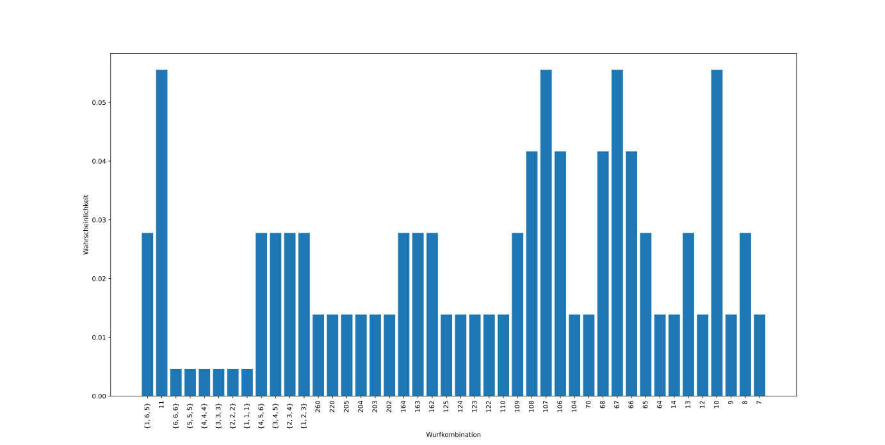
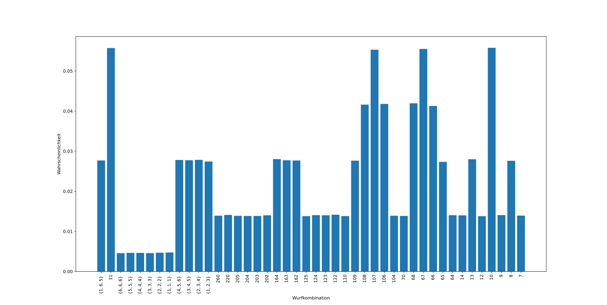

# Hauspasch Simulation
In diesem Projekt werden die Wahrscheinlichkeiten der Wurfkombinationen einer traditionellen Variante des Spiels **Hauspasch** simuliert, sowie die daraus resultierenden Spielstrategien.

Für dieses Spiel gibt es regional unterschiedliche Spielregeln: Um dieses Programm bestmöglich verstehen zu können, werden die diesem Projekt zugrundeliegenden Spielregeln im folgenden Punkt erklärt.

## Spielregeln
Voraussetzungen:
- Mindestens zwei Spieler
- Drei Würfel mit Würfelbecher
- Sieben Chips (Fehlpunkte)

Ein zufälliger Spieler beginnt mit Würfeln, die Summe der Augen ergeben seine Würfelpunkte, wobei **1** 100 Punkten entspricht und **6** 60 Punkten.

Beispiele:
- 4-2-4 -> 4+2+4 = 10 Punkte
- 1-2-5 -> 100+2+5 = 107 Punkte
- 6-5-1 -> 60+5+100 = 165 Punkte

Nach dem Wurf kann der Spieler entscheiden, ob er mit der höhe der gewürfelten Punkte zufrieden ist, oder ob er alle Würfel noch einmal wirft. Insgesamt darf er maximal drei Mal pro Runde werfen. Allgemein gilt: Je höhere Punkte, desto besser.

Es gibt aber auch ein paar Sonderfälle: 

| Bezeichnung    | Stellenwert |
| -------- | ------- |
| 1-6-5 (Würfelsumme 165) | 1 |
| 3-3-5, 2-4-5, 4-4-3 (Würfelsumme 11) | 2 |
| 6-6-6 (6er Pasch) | 3 |
| 5-5-5 (5er Pasch) | 4 |
| 4-4-4 (4er Pasch) | 5 |
| 3-3-3 (3er Pasch) | 6 |
| 2-2-2 (2er Pasch) | 7 |
| 1-1-1 (1er Pasch) | 8 |
| 4-5-6 (Straße) | 9 |
| 3-4-5 (Straße) | 10 |
| 2-3-4 (Straße) | 11 |
| 1-2-3 (Straße) | 12 |
| Alle restlichen Kombinationen absteigend nach Würfelpunkten | 13-44 |

Anschließend werden die Würfel an den nächsten Mitspieler in der Runde weitergegeben, dieser hat maximal gleich viele Versuche wie der erste Spieler in der Runde, kann aber auch weniger Versuche nutzen.

Das Ziel ist es, in einer Runde nicht die wenigsten Würfelpunkte zu haben. Eine Runde endet, sobald alle Mitspieler gewürfelt haben. Derjenige Spieler, der in einer Runde am wenigsten Punkte hat, bekommt einen Fehlpunkt in Form eines Chips und darf die nächste Runde beginnen.

Sobald alle Chips vergeben sind (in diesem Fall sieben, es können aber auch mehr oder weniger sein) ändert sich der Spielmodus. Jetzt ist es das Ziel, die höchsten Würfelpunkte in einer Runde zu werfen. Ebenfalls haben alle Mitspieler immer gleich viele Versuche wie der erste Spieler der Runde verwendet hat (ebenfalls hat dieser wieder maximal drei Versuche).

Derjenige, der die höchsten Würfelpunkte geworfen hat, darf einen Chip ablegen und mit der nächsten Runde beginnen. Wer keine Fehlpunkte mehr bei sich liegen hat, hat das Spiel gewonnen.

Bei Gleichstand der Würfelpunkte von zwei oder mehreren Spielern gibt es zwischen diesen ein Sudden-Death: Die betroffenen Spieler würfeln so lange, bis sich die Würfelpunkte unterscheiden.

## Wahrscheinlichkeiten
Hier ein Diagramm der theoretischen Wahrscheinlichkeit aller Wurfkombinationen ausgehend von den einzelnen Wahrscheinlichkeiten der drei Laplace Würfel:

Hier ein Diagramm der mit diesem Programm und Pseudo-Zufallszahlen aufgetretenen Wahrscheinlichkeiten bei $n = 1.000.000$

